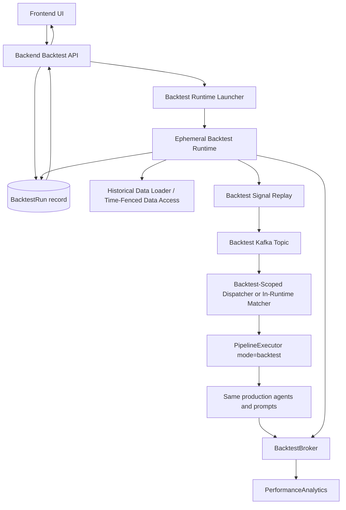
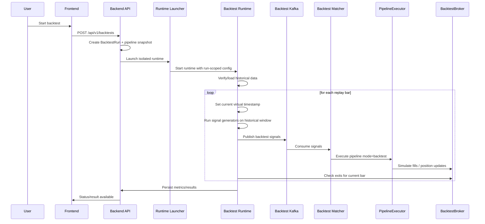
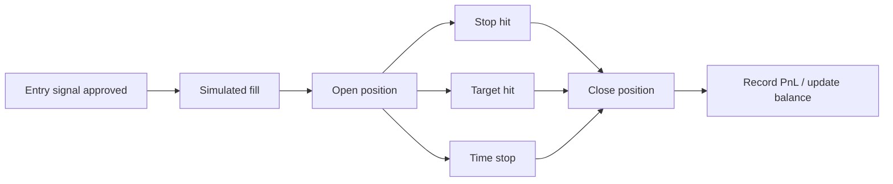
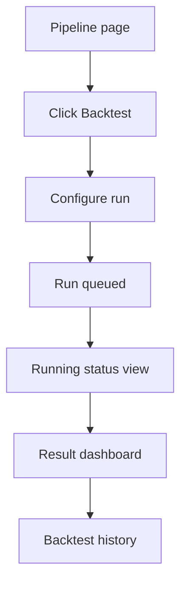

# Backtesting Engine Final Proposal

## Status

Review draft before implementation.

## Objective

Support full-pipeline backtesting for user-created pipelines, where a user can:

1. build or select a pipeline
2. choose a predefined symbol set
3. choose a historical date range
4. run the pipeline through the real execution chain as closely as practical
5. get results much faster than real time
6. avoid material LLM/token cost during replay

This proposal merges:

- the implementation detail from `docs/claude_backtest.md`
- the architecture and isolation guidance from `docs/full-pipeline-backtesting-proposal.md`

---

## Executive Summary

The recommended design is a **production-parity ephemeral backtest runtime**.

It is not:

- a pure in-process simulator
- a permanently shared backtest worker pool
- a replay that shares live queues and workers unsafely

It is:

- one isolated backtest runtime per run
- shared Postgres, Redis, Kafka, and historical data infrastructure
- strict run-scoped namespacing on every shared system
- a virtual clock that advances bar-by-bar
- the same agent logic and prompts used in production
- a simulated broker and position lifecycle

This gives the best balance of:

- fidelity to production behavior
- faster-than-real-time execution
- controlled token cost
- operational safety

---

## Design Decision

### Chosen option: Production-parity ephemeral per-run sandbox

We will reuse shared infrastructure where that meaningfully improves scale and cost:

- Postgres
- Redis
- Kafka
- historical data storage
- the same production agent logic, prompts, tools, and model paths

We will isolate or simulate the parts that are run-specific, live-only, or unsafe:

- runtime process space
- signal replay loop
- pipeline execution workers for that run
- broker execution
- virtual clock and position monitoring clock
- market data access beyond the current replay timestamp

### Why this option

Compared with a pure simulator:

- it validates more of the real production execution path
- it reduces drift between live and backtest behavior

Compared with a fully shared live stack:

- it avoids interference with real trading traffic
- it gives cleaner reproducibility and run isolation

Compared with spinning up a full mini-cluster per user:

- it avoids duplicating stateful services
- it keeps startup cost and runtime cost reasonable

---

## Core Principles

### 1. Close to production, not identical at any cost

Backtesting should validate the real execution chain where it matters, but not at the cost of speed, safety, or runaway token spend.

### 2. No look-ahead bias

Every backtest read must be limited to data available at the current virtual timestamp.

### 3. No live side effects

Backtests must never:

- place real broker orders
- interfere with live Celery queues
- pollute live Kafka topics unless explicitly routed and isolated

### 4. Production parity first

If the product edge comes from LLM planning, then the default backtest mode must keep LLM planning enabled. Otherwise the backtest is not measuring the same pipeline that runs in production.

### 5. Optional fast mode later

A deterministic replay mode can exist later for cheaper infra validation and rapid iteration, but it is not the primary truth for strategy evaluation.

---

## High-Level Architecture



---

## Runtime Components

### `backtest-runtime-launcher`

Responsible for:

- creating the runtime launch request
- passing run-scoped env and config
- selecting the launcher backend
- tracking runtime startup failure separately from replay failure

This belongs to the backend control plane.

### `backtest-runtime`

Responsible for:

- preparing the run
- verifying historical data coverage
- advancing virtual time
- invoking signal generators on historical windows
- publishing backtest-tagged signals
- running the backtest-scoped execution loop
- evaluating position exits
- finalizing metrics and results

This is the single-use data plane for one backtest run.

### `backtest signal dispatcher / matcher`

A backtest-safe signal matching layer that:

- consumes only backtest signals
- applies the same matching rules as live trigger-dispatch
- invokes the same execution path for that run

This can live inside the runtime instead of as a permanently running shared service.

### `BacktestBroker`

A simulated broker layer that:

- tracks positions and balance
- applies slippage and commission
- records fills and trade lifecycle
- never calls a real broker

### Historical data and time-fencing

All market data access must be constrained by:

- the run ID
- the current replay timestamp

This is the main mechanism that keeps the replay causal.

---

## Isolation Model

This is mandatory.

Backtests must not share execution channels with live trading by default.

### Required isolation

- dedicated backtest runtime per run
- dedicated Kafka topic: `trading-signals-backtest` or equivalent strict routing
- dedicated Redis namespace: `backtest:{run_id}:*`
- explicit execution mode: `mode=backtest`
- explicit run context: `backtest_run_id`
- explicit environment tag: `environment=backtest`

### Deployment choices

Either of these is acceptable:

1. ephemeral per-run containers started by the backend
2. ephemeral per-run Kubernetes jobs or pods

The recommended production direction is **ephemeral per-run containers or pods**.
Shared always-on backtest workers are a transition path, not the target architecture.

---

## End-to-End Flow



---

## Virtual Clock and Replay Model

### Problem

If the system waits in real time for each candle, backtesting becomes unusable.

### Solution

Use a virtual bar clock.

For a `5m` backtest:

- do not sleep for five real minutes
- move from bar close to bar close immediately

### Replay loop

```text
for each bar timestamp in timeline:
  set current_ts
  generate signals from data <= current_ts
  dispatch matching pipeline executions
  wait until current bar executions complete
  evaluate stop/target/time exits
  advance to next bar
```

### Time-fencing contract

At every bar:

- the orchestrator writes `backtest:{run_id}:current_ts`
- execution paths resolve that timestamp
- all candle queries return only bars `<= current_ts`

Without this, the backtest is not valid.

---

## Signal and Trigger Design

### Signal generation

Do not run the live signal-generator service loop with wall-clock sleeps.

Instead:

- reuse the generator classes in `signal-generator/app/generators/*`
- invoke them inside the ephemeral backtest runtime
- compute against historical rolling windows
- publish results as backtest-tagged signals on backtest-only topics

This preserves generator logic while avoiding real-time delays.

### Trigger dispatch

The matching rules should stay aligned with the current dispatcher behavior:

- scanner ticker intersection
- signal type subscription
- confidence threshold
- duplicate execution protections as appropriate for backtest mode

The matching layer should consume only backtest signals or strictly filter them, and it should ideally run inside the sandbox rather than relying on a permanently running shared dispatcher.

---

## Agent Execution in Backtest Mode

Default backtest mode must be production-parity.

### Agent behavior table

| Agent | Live behavior | Backtest behavior |
|------|---------------|-------------------|
| Market Data Agent | fetches recent/live market data | same logic, but reads time-fenced historical candles |
| Bias Agent | production prompt + model/tool path | same production logic |
| Strategy Agent | production prompt + model/tool path | same production logic |
| Risk Manager Agent | production logic | same production logic |
| Trade Review Agent | production logic | same production logic |
| Trade Manager Agent | real broker / paper broker | same logic, except execution goes through `BacktestBroker` |

### Design rule

Backtesting should run the same pipeline behavior as production, with only these substitutions:

- virtual time instead of wall-clock time
- historical time-fenced data instead of current/live data
- simulated broker execution instead of live side effects

### Optional secondary mode

After parity mode is working, a second mode can be introduced:

- `fast_replay`

That mode may replace LLM-driven steps with deterministic approximations, but it should be clearly labeled as non-parity and unsuitable for measuring the true LLM-driven edge.

---

## Backtest Broker Design

`BacktestBroker` should:

- maintain account balance and buying power
- maintain open positions
- apply slippage and commission using existing simulation utilities
- record entries, exits, PnL, and exit reasons
- support stop-loss, take-profit, and time-stop handling

Recommended state model:

- active run state in Redis for speed and isolation
- final persisted results in Postgres

### Broker lifecycle diagram



---

## Data Strategy

### Requirements

- historical OHLCV coverage for requested symbols
- enough warmup data for indicators
- support for all required timeframes
- aligned replay timeline

### Pre-run preparation

Before replay begins:

1. inspect the pipeline to infer required timeframes
2. add the timeframes needed by signal generators
3. expand start date backward for warmup
4. verify data coverage
5. seed missing historical data if needed

### Warmup rule

The requested start date for trading is not necessarily the first date needed for calculation.

Examples:

- a 200-SMA signal needs at least 200 bars before the first valid decision
- multi-timeframe logic may need higher-timeframe history prior to the visible test window

---

## Cost Model For Parity Backtesting

Production-parity backtesting means LLM costs remain real. The backtest should therefore support:

- run-level cost estimates before launch
- user-configurable spend caps
- optional caching where safe
- model/version pinning for reproducibility

### Current pricing reference

As of April 11, 2026, OpenAI’s official API pricing page clearly lists `gpt-5.4` standard pricing at:

- input: `$2.50 / 1M tokens`
- output: `$15.00 / 1M tokens`

Sources:

- https://openai.com/api/pricing/
- https://platform.openai.com/docs/pricing/

### Repo-aligned model assumption

Current local defaults in this repo indicate `gpt-4o` is the common default for:

- `BiasAgent`
- `StrategyAgent`
- `RiskManagerAgent`
- `TradeReviewAgent`

So there are two ways to interpret cost:

1. `Verified reference pricing`
   Use current official `gpt-5.4` pricing for a reviewable estimate.
2. `Repo-current model defaults`
   The repo still defaults many agents to `gpt-4o`, but that exact pricing is not surfaced the same way on the current official pricing page. Treat any `gpt-4o` estimate as directional unless you verify it from current billing or an updated official pricing table.

The estimate below uses the verified `gpt-5.4` reference pricing so the math is grounded in current official pricing.

### Approximate per-execution token assumption

For one pipeline execution in an intraday backtest, a reasonable planning estimate is:

- Bias Agent: `2k-6k` input, `300-900` output
- Strategy Agent: `4k-10k` input, `500-1.5k` output
- Risk Manager Agent: `1k-3k` input, `200-600` output
- Trade Review Agent: `1k-3k` input, `200-800` output

Combined approximate range per execution:

- input: `8k-22k` tokens
- output: `1.2k-3.8k` tokens

Mid-case planning assumption:

- input: `15k`
- output: `2.5k`

### Approximate per-execution cost at `gpt-5.4` reference pricing

Using the mid-case assumption:

- input cost: `15,000 / 1,000,000 * $2.50 = $0.0375`
- output cost: `2,500 / 1,000,000 * $15.00 = $0.0375`
- total per pipeline execution: about `$0.075`

### One month intraday cost estimate

The key driver is not the number of bars, but the number of times the pipeline actually executes.

For one month of US equity intraday trading on `5m` bars:

- about `78` bars per trading day
- about `21` trading days per month
- about `1,638` bars per symbol per month

If your trigger frequency causes the pipeline to run:

- `50` times/month: about `$3.75`
- `100` times/month: about `$7.50`
- `250` times/month: about `$18.75`
- `500` times/month: about `$37.50`
- `1,000` times/month: about `$75`

### Multi-symbol examples

If you backtest a pipeline across a basket and total executions scale roughly with symbol count:

- `5 symbols`, `100 executions per symbol/month` -> `500` executions -> about `$37.50`
- `10 symbols`, `100 executions per symbol/month` -> `1,000` executions -> about `$75`
- `20 symbols`, `100 executions per symbol/month` -> `2,000` executions -> about `$150`

### Conservative upper-bound planning range

If prompts/tool outputs are heavier than the mid-case assumption, practical spend could land closer to:

- `$0.10-$0.20` per execution

That would imply:

- `500` executions/month -> about `$50-$100`
- `1,000` executions/month -> about `$100-$200`
- `2,000` executions/month -> about `$200-$400`

### Interpretation

For a single user backtesting one intraday pipeline for one month, the likely LLM cost is usually not in the thousands of dollars. It is more likely in the:

- low single digits for sparse trigger rates
- tens of dollars for moderate trigger rates
- low hundreds only when execution frequency is high or prompts are unusually heavy

This is an estimate, not a guarantee. Actual cost depends on:

- number of pipeline executions triggered
- actual prompt size after market data/context injection
- tool-call fanout
- output verbosity
- model selected by the user

### Recommendation for product design

Before starting a backtest, show:

- estimated executions
- estimated token range
- estimated cost range
- hard max spend cap

This is necessary if parity mode remains the default.

---

## API Proposal

### Create backtest run

`POST /api/v1/backtests`

Request:

```json
{
  "pipeline_id": "uuid",
  "symbols": ["AAPL", "MSFT", "NVDA"],
  "start_date": "2024-01-01",
  "end_date": "2024-06-30",
  "timeframe": "5m",
  "initial_capital": 10000,
  "slippage_model": "fixed",
  "slippage_value": 0.01,
  "commission_model": "per_share",
  "commission_value": 0.005
}
```

Response:

```json
{
  "run_id": "uuid",
  "status": "PENDING"
}
```

### Poll run status

`GET /api/v1/backtests/{run_id}`

Response:

```json
{
  "run_id": "uuid",
  "status": "RUNNING",
  "progress": {
    "current_bar": 4521,
    "total_bars": 15000,
    "percent_complete": 30.1,
    "eta_seconds": 900
  }
}
```

### Get final result

`GET /api/v1/backtests/{run_id}/results`

### List history

`GET /api/v1/backtests`

### Cancel run

`DELETE /api/v1/backtests/{run_id}`

---

## Data Model Proposal

### `BacktestRun`

Suggested fields:

```text
id              UUID PK
user_id         UUID
pipeline_id     UUID
pipeline_name   VARCHAR
status          ENUM(PENDING, RUNNING, COMPLETED, FAILED, CANCELLED)
config          JSONB
progress        JSONB
metrics         JSONB
equity_curve    JSONB
trades_count    INT
failure_reason  TEXT NULL
created_at      TIMESTAMP
started_at      TIMESTAMP
completed_at    TIMESTAMP
```

---

## UI Proposal

The UI should treat backtests as asynchronous jobs, not synchronous API calls.

### User flow



### UI v1 scope

#### Configuration screen

- pipeline selector or prefilled pipeline
- predefined symbol basket selector
- date range
- timeframe
- capital
- slippage/commission presets
- start button

#### Running screen

- status badge
- percent complete
- current replay bar / total bars
- symbol count
- cancel action

#### Result screen

- summary metrics
- equity curve
- trades table
- per-symbol performance
- trigger count vs executed trades
- reject reasons
- run metadata

### Nice-to-have later

- walk-forward mode
- portfolio comparison
- side-by-side run diff
- parameter sweep

---

## Implementation Plan

### Phase 1: control plane and runtime contract

- keep `BacktestRun` as the source of truth
- snapshot the pipeline, trigger config, and runtime settings at run creation time
- add a `BacktestRuntimeLauncher` abstraction in backend
- stop treating shared backtest workers as the target architecture
- keep any legacy shared-runtime path only as a temporary development bridge

### Phase 2: single-purpose backtest runtime image

- create a dedicated runtime entrypoint for one backtest run
- move replay startup into a single-run process contract
- pass run-scoped env such as `BACKTEST_RUN_ID`, topic names, and Redis prefixes
- ensure the runtime can hydrate itself from the stored snapshot

### Phase 3: in-runtime signal replay and execution loop

- run signal generation inside the runtime
- run backtest-scoped matching/dispatch inside the runtime
- keep `PipelineExecutor` parity and `mode=backtest`
- remove dependency on permanently running shared backtest dispatcher/worker services

### Phase 4: isolation hardening

- enforce run-scoped Redis and Kafka namespaces everywhere
- add snapshot/version pinning for prompts and model settings
- add cancellation and runtime cleanup
- add tests for overlapping runs on the same pipeline

### Phase 5: scaling controls

- add launcher backends for Docker and Kubernetes
- add admission control, per-user concurrency limits, and quotas
- add runtime metrics, cost accounting, and artifact collection
- optimize startup latency and reduce per-bar DB churn

### Phase 6: frontend

- configuration flow
- estimated cost and runtime mode display
- status polling
- result dashboard
- history listing

---

## File-Level Implementation Targets

### Likely backend changes

- `data-plane/app/api/v1/data.py`
- `data-plane/app/services/data_fetcher.py`
- `backend/app/orchestration/executor.py`
- `backend/app/orchestration/tasks/execute_pipeline.py`
- `backend/app/schemas/pipeline_state.py`
- `backend/app/agents/bias_agent.py`
- `backend/app/agents/strategy_agent.py`
- `backend/app/agents/risk_manager_agent.py`
- `backend/app/agents/trade_review_agent.py`
- `backend/app/agents/trade_manager_agent.py`

### New backend files

- `backend/app/backtesting/orchestrator.py`
- `backend/app/backtesting/backtest_broker.py`
- `backend/app/backtesting/data_seeder.py`
- `backend/app/orchestration/tasks/run_backtest.py`
- `backend/app/models/backtest_run.py`
- `backend/app/api/v1/backtests.py`

### Likely frontend files

- `frontend/src/app/core/services/backtest.service.ts`
- `frontend/src/app/features/backtesting/*`

---

## Key Risks

### Shared runtime interference

Risk:

- backtest traffic interferes with live operations

Mitigation:

- dedicated queue/topic/namespaces

### Future data leakage

Risk:

- invalid results due to look-ahead bias

Mitigation:

- strict `backtest_ts` enforcement
- targeted tests

### Hidden LLM usage

Risk:

- expensive or nondeterministic replay, especially if parity mode uses production LLM calls

Mitigation:

- show estimated spend before run
- support run-level spend caps
- pin model/version where possible

### Slow long-range runs

Risk:

- replay time grows too much with bar count and symbol count

Mitigation:

- preload historical data
- keep rolling windows in memory where practical
- parallelize where symbol independence allows

---

## Verification Strategy

Before rollout, verify:

1. time-fence correctness
2. same agent stack is reached in production and parity backtest mode
3. no real broker calls in backtest mode
4. trigger matching parity with live dispatcher rules
5. isolated routing for backtest queue/topic
6. acceptable replay cost visibility and spend caps

---

## Recommendation

Proceed with this architecture:

- ephemeral per-run backtest runtime
- shared Postgres, Redis, Kafka, and historical data services
- virtual clock
- production-parity agent execution
- simulated broker and exits
- strict backtest-only namespaces on all shared systems

This is the most credible path to "run the whole 9 yards" of the pipeline while keeping production behavior intact and making multi-tenant isolation defensible.

---

## Review Questions

Before later phases, the team should explicitly approve:

1. Is the first production launcher target Docker containers, Kubernetes jobs, or both?
2. Should Phase 2 keep a legacy shared-runtime fallback for local development only?
3. Should v1 support single-pipeline runs only, or portfolio/multi-pipeline comparisons?
4. Do we want a dedicated Kafka topic for backtests, or strict metadata routing on a shared cluster?
5. Is walk-forward validation in scope for v1, or a later phase?
