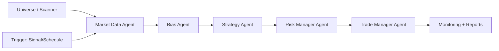

## Pipeline Builder Redesign (Proposal)

### Why change it
The current builder is a **general-purpose node graph** (drag nodes + connect edges). That’s powerful, but for our current product reality it creates UX + reliability problems:

- **Too much freedom**: users can build invalid graphs and only discover problems at runtime.
- **Hard to reason about**: “where do I put instructions?”, “which tools connect where?”, “why did it run with the wrong ticker/timeframe?”
- **Higher bug surface**: edges + tool nodes + agent configs + saved JSON all need to stay in sync.

For now we **always need the same core agents** (Market Data → Bias → Strategy → Risk → Trade Manager), and the differentiator is **instructions + tools + triggers**. So the UI should reflect that.

---

### Design goals
- **Make the “happy path” obvious**: a new user can create a working pipeline in minutes.
- **Constrain the model** so invalid pipelines are hard/impossible to create.
- **Keep agent-first**: users configure behavior via instructions; backend stays thin.
- **Tools feel like “tentacles”**: users attach tools to the central pipeline body and to specific agent sections.
- **Clear readiness signals**: each agent section turns **green** when configured; **yellow** when incomplete; **red** when invalid.
- **Keep power-user escape hatches**: an optional “Advanced Canvas” view can still exist later.

---

## Concept: “Pipeline Organism”

Think of a pipeline as a **central core** with fixed internal organs (agents) and **external tentacles** (tools + triggers + universe).

### Primary screen layout (wireframe)

```text
┌───────────────────────────────────────────────────────────────────────────────┐
│ Pipeline: [ Forex London Breakout ]     Mode: [Paper ▼]     Est: $0.12 / run  │
│ Status: Draft • Validation: 2 warnings                                         │
├───────────────────────────────────────────────────────────────────────────────┤
│ Left rail (guided)                 Center (organism)             Right panel  │
│ ┌───────────────────────────────┐  ┌───────────────────────────┐ ┌──────────┐ │
│ │ 1) Name + Mode        ✅      │  │        PIPELINE CORE       │ │ Details  │ │
│ │ 2) Universe (Scanner) 🟡      │  │   (the “blob body”)        │ │ / Config │ │
│ │ 3) Triggers           ✅      │  │ ┌───────────────────────┐ │ │          │ │
│ │ 4) Tools              🟡      │  │ │ Market Data      ✅🟢  │ │ │ Context  │ │
│ │ 5) Instructions       🟡      │  │ │ Bias             🟡    │ │ │ + JSON   │ │
│ │ 6) Review + Cost      ⬜      │  │ │ Strategy         🟡    │ │ │ Schema   │ │
│ │ 7) Activate           ⬜      │  │ │ Risk Manager     ⬜    │ │ │          │ │
│ └───────────────────────────────┘  │ │ Trade Manager    ⬜    │ │ └──────────┘ │
│                                     │ └───────────────────────┘ │             │
│                                     │  Tentacles (Tools)        │             │
│                                     │  [Scanner] [Broker]        │             │
│                                     │  [Notifier] [Indicators]   │             │
│                                     └───────────────────────────┘             │
└───────────────────────────────────────────────────────────────────────────────┘
```

### Visual states (simple, consistent)
- **Gray (⬜)**: not started
- **Yellow (🟡)**: partially configured / missing required fields
- **Green (🟢)**: configured + valid
- **Red (🔴)**: invalid / incompatible config (must fix before activation)

The center “core” shows the fixed agent chain. Each agent section has:
- **Title + status chip**
- **Required inputs checklist** (auto-derived from metadata + pipeline state)
- **Instruction editor** (single prominent text area)
- **Tool attachments** (chips / small connectors)
- **Quick test** (run this agent only in validation mode; optional)

---

## Fixed core agents (MVP)

### Agent order is fixed
We present a **single, canonical pipeline** (for now). Users configure *behavior* (instructions) and *integrations* (tools), but do not rewire the core.

Core execution order:
- **Market Data Agent** → fetch candles/indicators across required timeframes
- **Bias Agent** → compute directional bias (must use provided context, not invent bias)
- **Strategy Agent** → produce trade plan (entry/SL/TP) aligned to bias
- **Risk Manager Agent** → approve/size trade based on broker account + risk rules
- **Trade Manager Agent** → execute + monitor lifecycle (market/limit/bracket, close, P&L)

Reporting is effectively **always-on** (agent reports + monitoring view); we can treat it as a system function rather than a draggable block.

### Fixed flow diagram



---

## Tool “tentacles”

Tools are shown as **chips/cards around the core**. Attaching a tool draws a subtle “tentacle” line to the agent section that consumes it.

### Tool rack (examples)
- **Universe tools**
  - **Scanner**: ticker list (signal pipelines)
  - **Manual symbol**: single symbol (periodic/manual)
- **Trigger tools**
  - **Signal subscriptions**: signal type + optional timeframe + confidence threshold
  - **Schedule**: interval / market window
- **Execution tools**
  - **Broker**: OANDA / Alpaca / Tradier (per mode)
  - **Webhook**: fire-and-forget execution
- **Data/indicator tools**
  - **Data Plane**: candles + indicators
  - **Indicators**: RSI/MACD/etc (if configured separately)
- **Notification tools**
  - **Webhook Notifier**
  - **(future)** email / push / Slack

### Attachment rules (guardrails)
Tools can be attached only where they make sense:
- **Market Data** requires a data source (Data Plane / provider).
- **Trade Manager** requires **Broker OR Webhook**.
- **Live mode** requires a Broker tool + successful broker connection test.
- **Signal trigger mode** requires Scanner + at least one signal subscription (or explicit “accept all signals”).

When a user attempts an invalid attachment, we show:
- **Plain English error**
- **A fix action** (“Attach broker to Trade Manager”, “Switch pipeline to Paper mode”, etc.)

---

## “Turning green” rules (configuration readiness)

Each agent section has a **readiness evaluator** that sets its color state.

### Readiness definition
- **Green (🟢 Configured)** when:
  - instructions present (non-empty), and
  - required tools attached, and
  - required timeframes satisfied, and
  - upstream dependency present (e.g., Strategy requires Bias output enabled)
- **Yellow (🟡 Incomplete)** when:
  - missing instructions OR missing optional-but-recommended items
- **Red (🔴 Invalid)** when:
  - contradictory config (e.g., Live mode + no broker)
  - missing required tool
  - invalid numbers (SL = entry, negative pips, etc.)

### Global pipeline readiness
Top bar shows **Draft / Ready / Active / Error** plus a single **“What’s blocking activation?”** list that aggregates the section validators.

---

## UX flow (simple, fast, safe)

### Left rail (guided steps)
This is not a rigid wizard; it’s a **progress checklist** that can be visited in any order:
- **Name + Mode**
  - Pipeline name
  - Mode: Validation / Simulation / Paper / Live
- **Universe**
  - Choose: Scanner (signal pipelines) or Manual symbol (periodic/manual)
  - Show ticker count + preview list (first 10) with “View all”
- **Triggers**
  - **Signal**: choose signal type + timeframe + min confidence
  - **Periodic**: choose interval + window + timezone
- **Tools**
  - Attach broker / webhook / notifier / data provider
  - Show compatibility warnings (“OANDA supports trade_id vs order_id reconciliation”)
- **Instructions**
  - One prominent instruction editor per agent (with examples)
  - Optional templates (Beginner / Conservative / Aggressive)
- **Review + Cost**
  - Cost per run + estimated daily/monthly based on trigger mode
  - “Explain my costs” breakdown by agent + LLM model
- **Activate**
  - Activation toggles + guardrails (Live mode confirmations, broker checks)

### The center stays constant
Regardless of which step is selected, the **central organism stays visible**, and the relevant agent section expands/highlights.

---

## Agent section design (what users actually see)

Each agent section is a **card with three tabs**:
- **Behavior (Instructions)**: the one big text area + examples
- **Inputs**: read-only summary of what this agent will receive (timeframes, bias context, etc.)
- **Tools**: attached tool chips + “Attach tool” CTA

Example: Strategy Agent section:
- **Status chip**: 🟡 “Needs instructions”
- **Behavior**: instruction editor + quick hints (pip size, SL/TP units, “use provided bias context”)
- **Inputs**: primary timeframe, bias payload, candle range
- **Tools**: none required, but can attach “chart annotation” tool in future

---

## Timeframes: make them explicit and consistent

Timeframes are a common source of mismatch and silent errors. The builder should:
- Provide a **single place** that shows “Timeframes used by this pipeline”
- Merge requirements from all agents:
  - Bias: (e.g.) 60 / 240 / D
  - Strategy: (e.g.) 5
  - Trade Manager monitoring interval: (e.g.) 0.25 min / 15 sec

Recommended UI:
- **Primary timeframe** selector (Strategy)
- **Bias timeframes** multi-select
- Show the effective final set (deduped) with a “why” tooltip per agent

---

## Reduce reliability issues (what this design prevents)

This redesign directly addresses recurring issues we’ve seen:
- **Wrong symbol**: Universe is first-class; symbol/scanner becomes a top-level “organism tentacle”, not a hidden config field.
- **Wrong timeframe**: central, visible timeframe selection; signal subscription timeframe is explicit.
- **Tool mismatch**: broker/webhook must attach to Trade Manager; invalid combos are blocked.
- **Lost reports**: the UI pushes “agent reports are part of the pipeline core”, not optional nodes.
- **Stuck executions**: activation page includes “health checks” (worker online, broker reachable, budget OK).

---

## Data model mapping (keep backend stable)

We keep the existing storage model:

- Pipeline persists:
  - `trigger_mode` (signal/periodic)
  - `scanner_id` (optional)
  - `signal_subscriptions` (type + optional timeframe + min_confidence)
  - `config` JSONB:
    - `nodes`: agent nodes (and tool attachments inside node config)
    - `edges`: optional (can be auto-generated for fixed chain)
    - `symbol`, `mode`

### Save strategy (fixed chain)
On save, the UI **always generates**:
- A fixed set of `nodes` (one per agent) with stable `agent_type`
- A fixed set of sequential `edges` (MD→Bias→Strategy→Risk→TM)
- `position` can be stored for backward compatibility, but it’s not user-editable in the new UI

This lets us **ship the new UI without rewriting the backend**.

---

## Implementation plan (frontend-first, low-risk)

### Phase 0 (no backend changes required)
- Add a new builder view: **“Guided Builder (Recommended)”**
- Keep existing graph builder behind **“Advanced Canvas (Legacy)”**
- Both views save to the same pipeline JSONB format

### Phase 1 (reliability)
- Real-time validation rules + inline fix actions
- Stronger “Ready to Activate” gate
- Better defaults + templates

### Phase 2 (power + future)
- Optional extra agents (e.g., News, HTF Confirmations) behind “Advanced”
- Versioning + diff view (from `product-ux-gaps.md`)
- Per-agent quick test (Validation mode) with cached outputs

---

## Visual inspiration (references)
These are UI patterns worth borrowing from (not copying):
- [n8n](https://n8n.io/) — clear node configuration UX, great affordances
- [Zapier Interfaces / Canvas](https://zapier.com/) — guided setup + guardrails
- [Apple Shortcuts](https://support.apple.com/guide/shortcuts/welcome/ios) — “blocks” but still guided for non-technical users
- [Linear](https://linear.app/) — crisp “ready states” and calm validation UX

---

## Open questions (to decide before implementation)
- **Do we hide the edge concept entirely** in Guided Builder, or show it as a subtle “fixed flow” header?
- **Do we enforce templates first** (recommended), or allow “blank but fixed core”?
- **Do we allow multiple strategies per pipeline** (future multi-symbol) or keep single-symbol for now?

