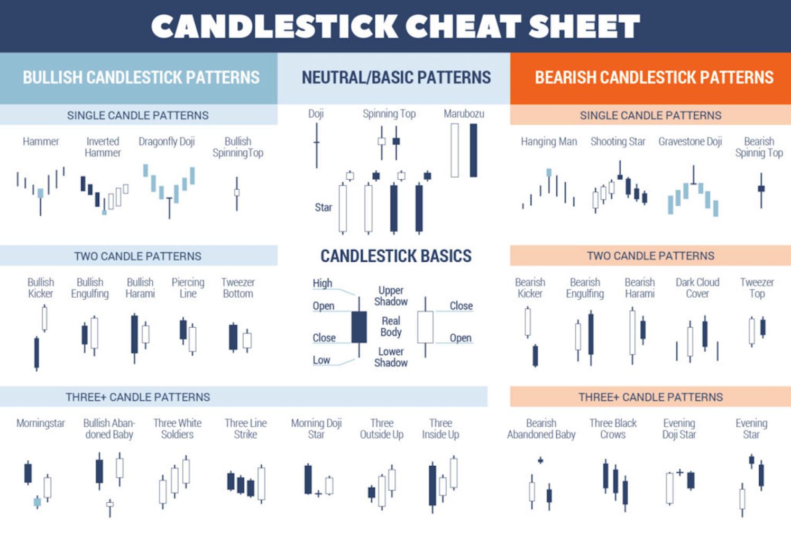

# Candlestick Patterns

Candlestick patterns are the building blocks of price action analysis. They reveal the battle between buyers and sellers within specific time periods. Patterns are categorized by number of candles and signal direction.

## Pattern Categories

- [Bullish Patterns](bullish-patterns.md) — Single, double, and triple-candle bullish reversal/continuation signals
- [Bearish Patterns](bearish-patterns.md) — Single, double, and triple-candle bearish reversal/continuation signals

## Candlestick Anatomy

| Component | Description |
|-----------|-------------|
| **Real Body** | Distance between open and close |
| **Upper Shadow** | Wick from body to session high |
| **Lower Shadow** | Wick from body to session low |
| **Long Body** | Strong buying/selling pressure |
| **Short Body** | Little buying/selling activity |
| **Marubozu** | Full body, no shadows (strong conviction) |
| **Doji** | Open = Close (indecision) |

## Context Rules

Candlestick patterns are only meaningful in **context**:
1. **Trend**: A hammer is only bullish at the bottom of a downtrend
2. **Key Level**: Patterns at support/resistance are more significant
3. **Timeframe**: 4H and Daily patterns are more reliable than M5 patterns
4. **Confluence**: Patterns with additional confirmation (volume, indicators, ICT levels) are highest probability
