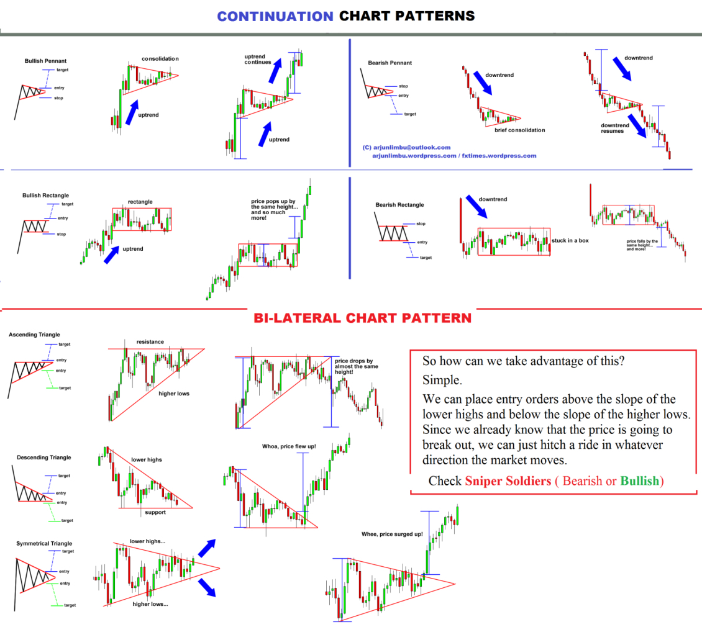

# Classic Chart Patterns

Classic chart patterns are geometric formations that appear on price charts, indicating likely continuation or reversal of the current trend. Each pattern has specific entry, stop loss, and target projection rules.

## Quick Reference

| Pattern | Type | Signal |
|---------|------|--------|
| [Triangle / Wedge](triangle.md) | Continuation or Reversal | Breakout direction |
| [Rectangle](rectangle.md) | Continuation | Breakout direction |
| [Pennant](pennant.md) | Continuation | Breakout in trend direction |
| [Cup and Handle](cup-and-handle.md) | Continuation (Bullish) | Breakout above rim |
| [Rounded Top/Bottom](rounded-top-bottom.md) | Reversal | Break of neckline |

## Images

All patterns have reference images in `../../images/patterns/classic/`.
