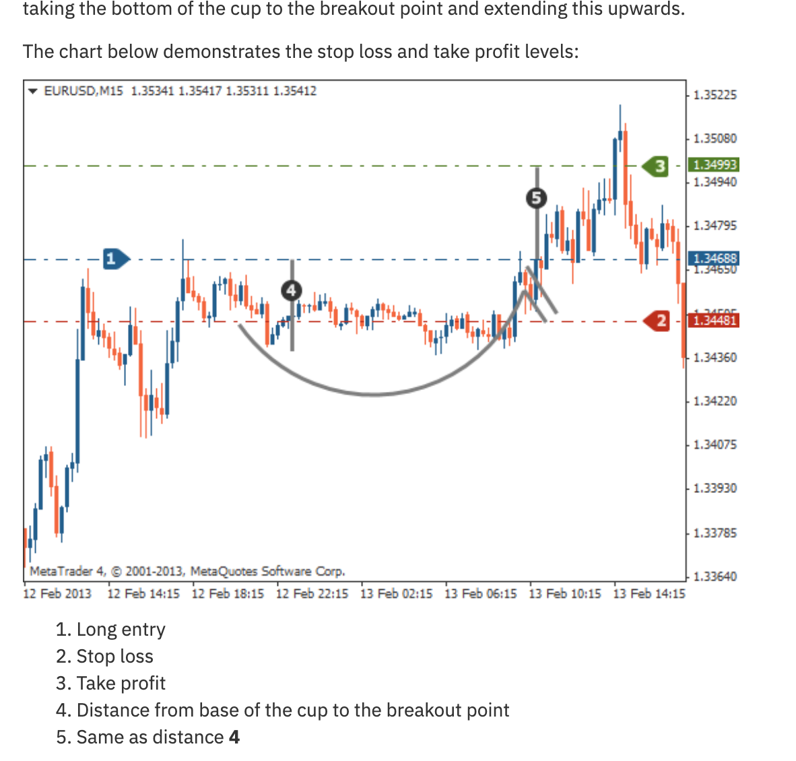

# Cup and Handle Pattern

## Definition

A bullish continuation pattern consisting of a U-shaped "cup" followed by a small downward-drifting channel (the "handle"). Named for its resemblance to a tea cup when viewed from the side.

## Structure

1. **Cup**: A U-shaped (rounded) bottom. NOT a V-shape — the cup should be gradual.
2. **Rim**: The horizontal resistance at the top of the cup (both sides roughly equal in height)
3. **Handle**: A small downward drift or consolidation after the right side of the cup
4. **Breakout**: Price breaks above the rim/resistance

## Trading Rules

| Component | Rule |
|-----------|------|
| **Long Entry** | Buy when price breaks above the rim (resistance line) |
| **Stop Loss** | Below the handle's low |
| **Take Profit** | Cup depth (base to rim) projected upward from the breakout |

**Measurement**: Distance from the base of the cup to the rim = expected move from the breakout point.

## Identification Rules

1. Prior uptrend must exist (continuation pattern)
2. Cup should be U-shaped, not V-shaped
3. Cup depth ideally retraces 33%-50% of the prior advance
4. Handle should retrace no more than 50% of the cup's advance (right side)
5. Handle should slope slightly downward or sideways
6. Volume decreases during cup formation, increases on breakout
