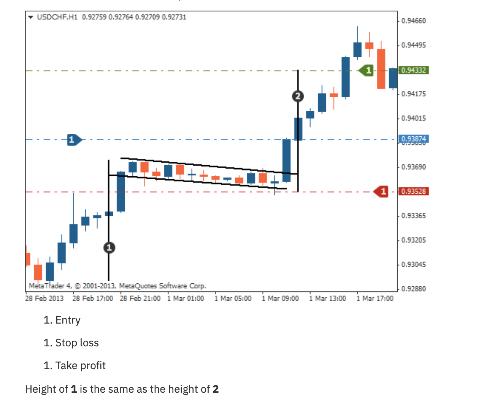

# Pennant Pattern

## Definition

A small symmetrical triangle (the pennant) that forms after a sharp, impulsive move (the flagpole). It's a continuation pattern — after the consolidation, price resumes in the flagpole direction.

## Structure

1. **Flagpole**: Sharp, impulsive move (up or down)
2. **Pennant**: Small symmetrical triangle (converging trendlines) where price consolidates
3. **Breakout**: Price breaks out in the direction of the flagpole

## Trading Rules

| Component | Rule |
|-----------|------|
| **Entry** | Buy/sell at breakout above/below the pennant |
| **Stop Loss** | Below the pennant (for bullish) or above (for bearish) |
| **Take Profit** | Height of the flagpole projected from the breakout point |

**Key Rule**: "Height of the flagpole = distance of the target projection." The flagpole height measured from the start of the move to the pennant entry equals the expected move from the breakout.
