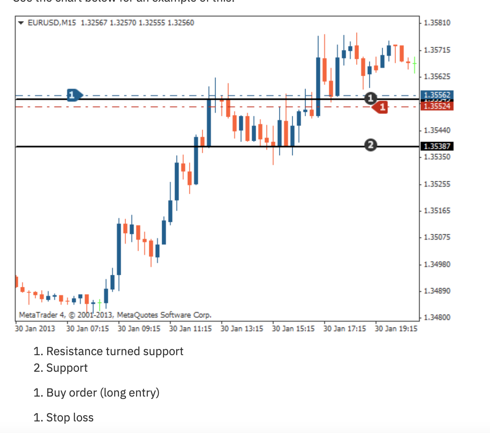
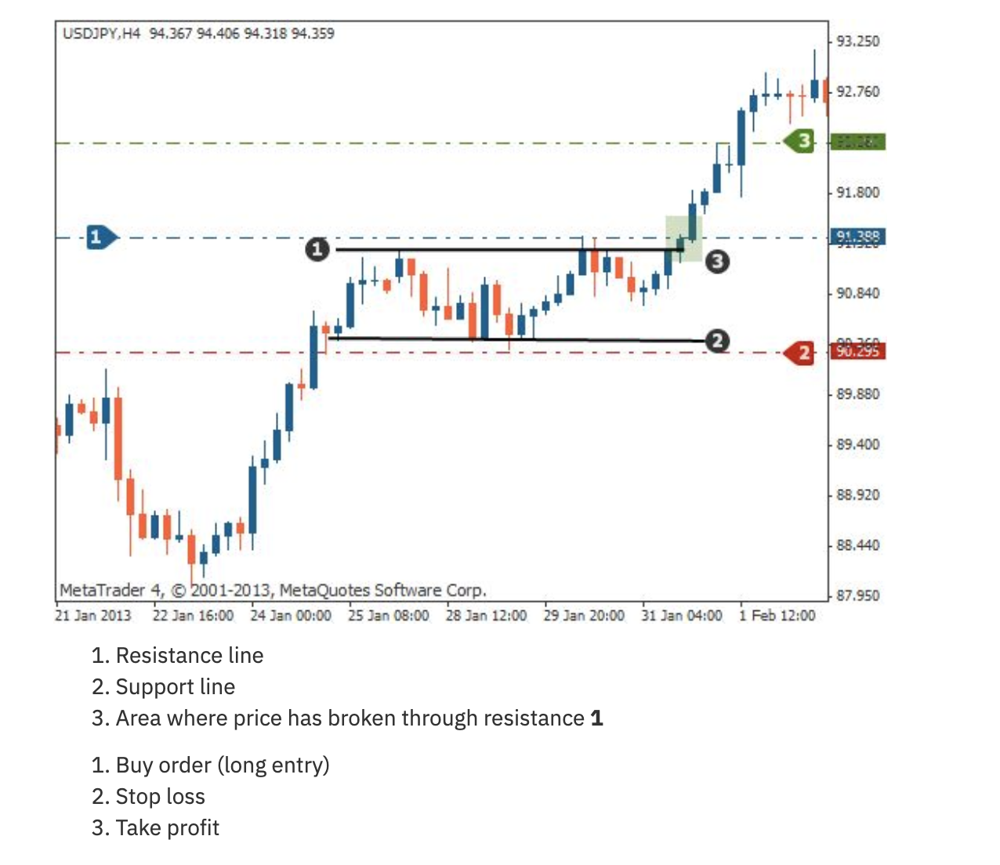

# Rectangle Pattern

## Definition

Price oscillates between horizontal support and resistance lines forming a box/rectangle. Eventually price breaks out in the direction of the prevailing trend.

## Types

### Bullish Rectangle
- Forms during an uptrend
- Price consolidates between parallel horizontal lines
- Breaks out **above** resistance
- Continuation pattern

### Bearish Rectangle
- Forms during a downtrend
- Price consolidates between parallel horizontal lines
- Breaks out **below** support
- Continuation pattern

## Trading Rules

| Component | Rule |
|-----------|------|
| **Entry** | Buy/sell after confirmed breakout (candle close beyond the rectangle) |
| **Stop Loss** | On the opposite side of the rectangle from the breakout |
| **Take Profit** | Height of the rectangle projected from the breakout point |

## Identification Rules

1. At least 2 touches on resistance line
2. At least 2 touches on support line
3. Lines should be approximately horizontal (not sloping)
4. Price should oscillate between them clearly
5. Volume often decreases during the consolidation
