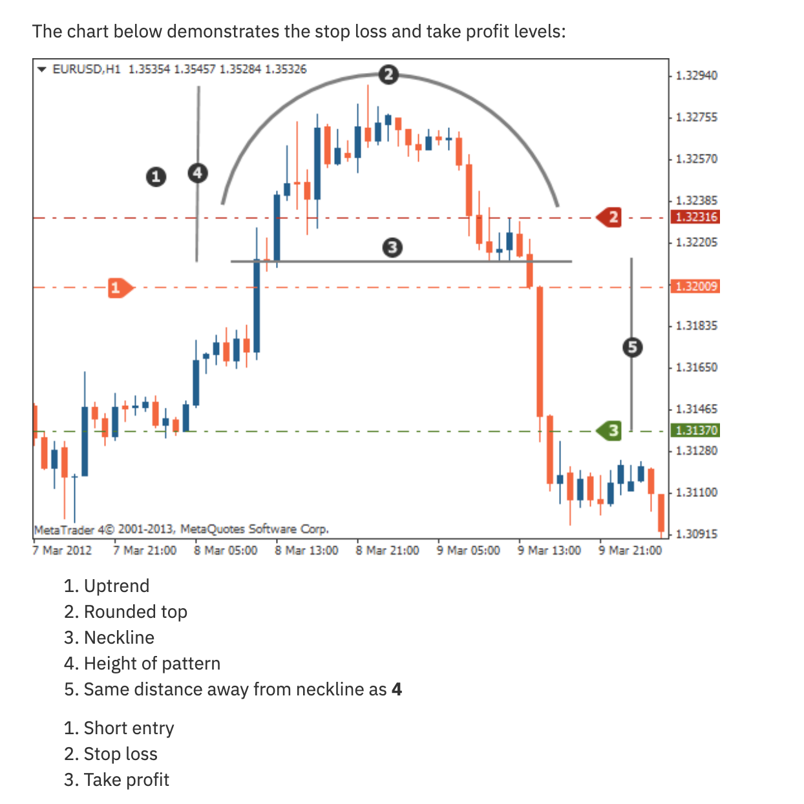
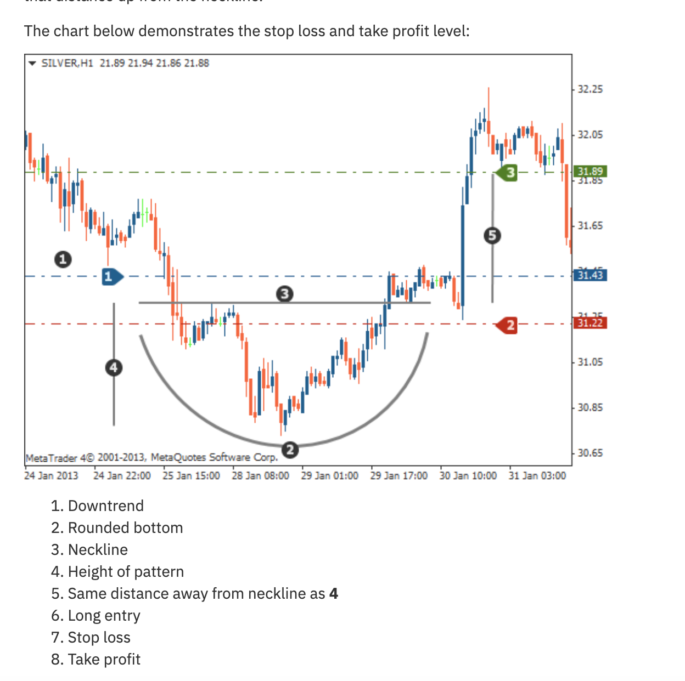

# Rounded Top and Bottom Patterns

## Rounded Bottom (Bullish Reversal)

### Structure
1. **Downtrend**: Price trends down leading into the pattern
2. **Rounded Bottom**: Gradual U-shaped curve in price (not a sharp V)
3. **Neckline**: Horizontal resistance at the top of the curve
4. **Breakout**: Price breaks above the neckline

### Trading Rules

| Component | Rule |
|-----------|------|
| **Long Entry** | After breakout above neckline |
| **Stop Loss** | Below the rounded bottom |
| **Take Profit** | Height of pattern (bottom to neckline) projected upward from neckline |

## Rounded Top (Bearish Reversal)

### Structure
1. **Uptrend**: Price trends up leading into the pattern
2. **Rounded Top**: Gradual arc/dome in price
3. **Neckline**: Horizontal support at the bottom of the arc
4. **Breakdown**: Price breaks below the neckline

### Trading Rules

| Component | Rule |
|-----------|------|
| **Short Entry** | After breakdown below neckline |
| **Stop Loss** | Above the rounded top |
| **Take Profit** | Height of pattern (neckline to top) projected downward from neckline |

## Key Identification Points

- The rounding should be **gradual**, not sudden
- Volume typically decreases during the rounding and increases at the breakout
- Pattern takes longer to form than most other patterns (weeks to months on daily charts)
- The neckline doesn't have to be perfectly horizontal but should be roughly so
