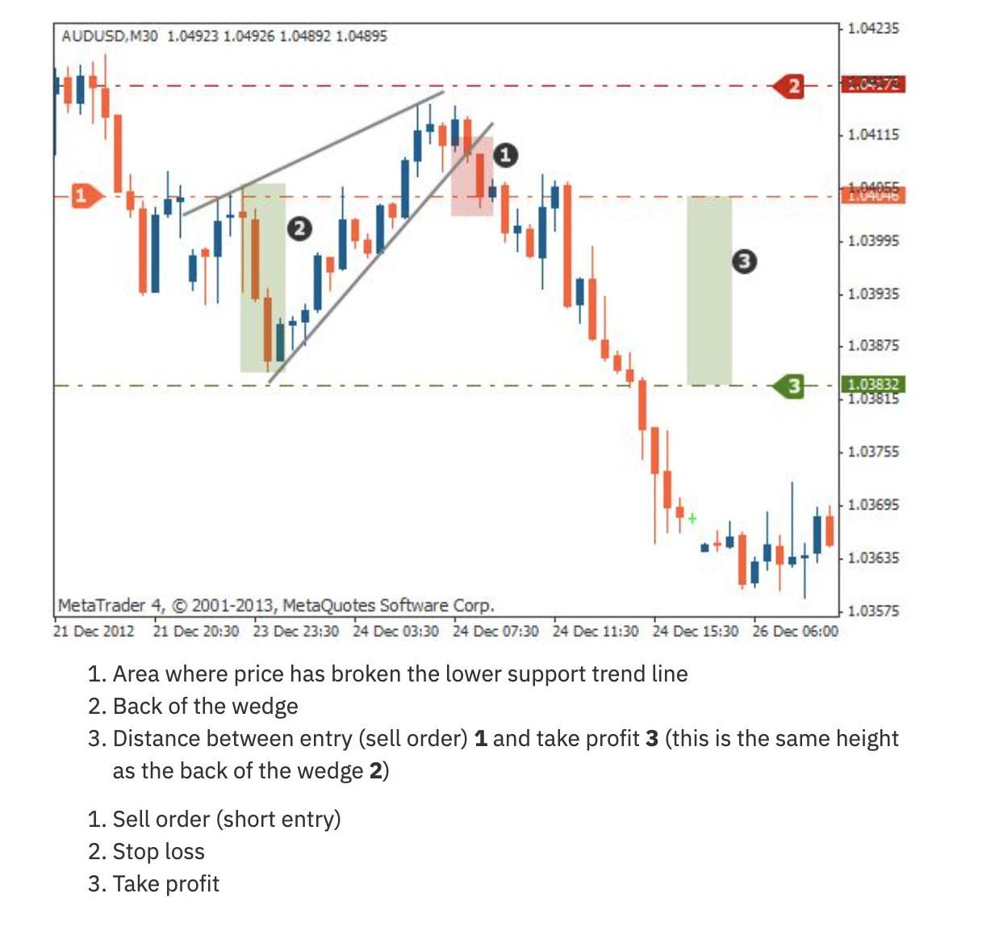
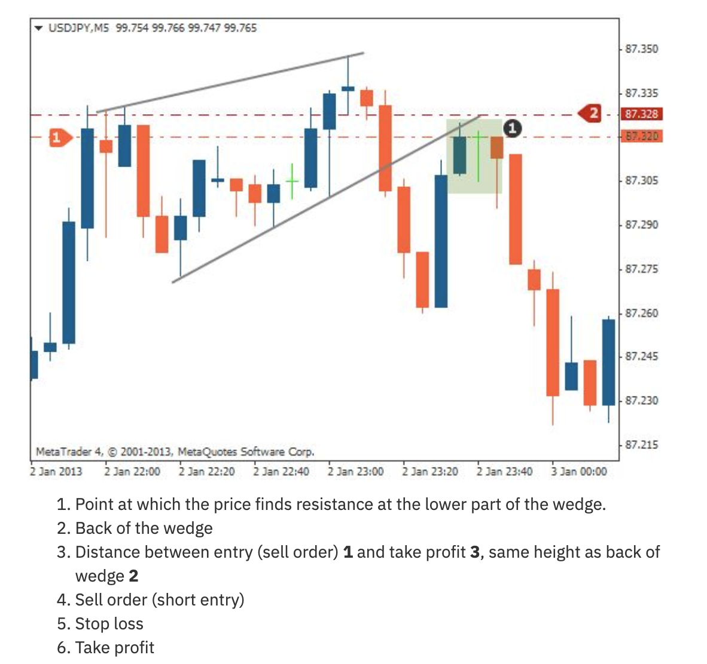

# Triangle / Wedge Patterns




## Types

### Rising Wedge (Bearish)
- Both support and resistance slope upward, but support is steeper
- Price makes higher highs and higher lows but the range narrows
- **Signal**: Bearish — expect downside breakout

**Trading Rules**:
| Component | Rule |
|-----------|------|
| **Entry** | Sell when price breaks the lower support trendline |
| **Stop Loss** | Above the back of the wedge (widest point) |
| **Take Profit** | Distance from entry = height of back of wedge |

### Falling Wedge (Bullish)
- Both support and resistance slope downward, but resistance is steeper
- Price makes lower highs and lower lows but the range narrows
- **Signal**: Bullish — expect upside breakout

**Trading Rules**:
| Component | Rule |
|-----------|------|
| **Entry** | Buy when price breaks the upper resistance trendline |
| **Stop Loss** | Below the wedge |
| **Take Profit** | Distance = wedge height at widest point |

### Symmetrical Triangle (Bilateral)
- Converging trendlines with no directional bias
- Can break in either direction
- **Strategy**: Place orders above upper trendline AND below lower trendline

## Agent Detection Logic

```
function detect_wedge(candles, min_touches=3):
    highs = [(i, c.high) for i, c in enumerate(candles)]
    lows = [(i, c.low) for i, c in enumerate(candles)]
    
    resistance = fit_trendline(highs, min_touches)
    support = fit_trendline(lows, min_touches)
    
    if not resistance or not support:
        return None
    
    # Check if converging
    if resistance.slope > 0 and support.slope > 0 and support.slope > resistance.slope:
        return RisingWedge(resistance, support, signal=BEARISH)
    
    if resistance.slope < 0 and support.slope < 0 and resistance.slope > support.slope:
        return FallingWedge(resistance, support, signal=BULLISH)
    
    if resistance.slope < 0 and support.slope > 0:
        return SymmetricalTriangle(resistance, support, signal=BILATERAL)
    
    return None
```
