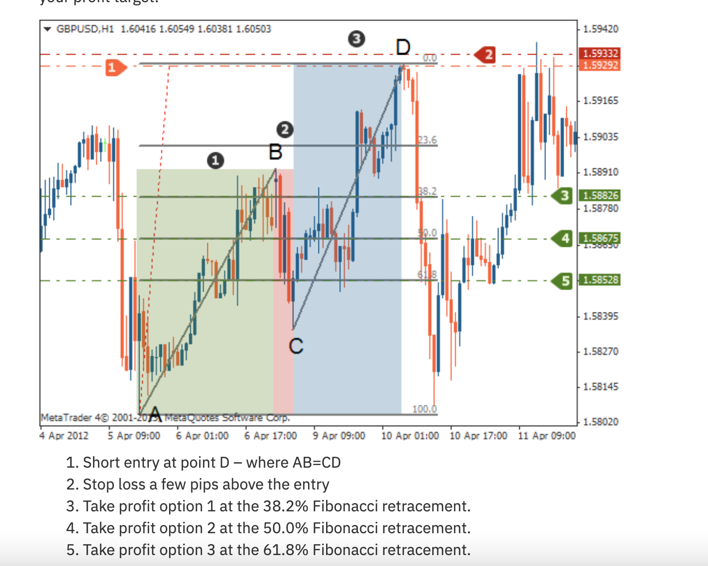

# AB=CD Pattern



## Definition

The AB=CD is the most fundamental harmonic pattern. Price moves from A to B, retraces to C, then travels an equal distance from C to D as it did from A to B. The AB leg equals the CD leg in both **price and time**. It represents symmetry in price delivery.

## Fibonacci Ratios

| Leg | Ratio |
|-----|-------|
| **BC** | 61.8% - 78.6% retracement of AB |
| **CD** | 127.2% - 161.8% extension of BC |
| **AB = CD** | Equal in price distance and ideally in time |

## Identification Rules

1. Find a clear A-B leg (impulsive move)
2. Price retraces from B to C (61.8%-78.6% of AB)
3. Price extends from C toward D
4. D completes where CD distance = AB distance
5. Visual symmetry: the two legs should look similar in slope and duration

## Trading Rules

### Bearish AB=CD (Price moving up A→B→C→D)
| Component | Rule |
|-----------|------|
| **Short Entry** | At point D where AB = CD |
| **Stop Loss** | A few pips above point D |
| **Take Profit 1** | 38.2% Fibonacci retracement of A-D |
| **Take Profit 2** | 50.0% retracement of A-D |
| **Take Profit 3** | 61.8% retracement of A-D |

### Bullish AB=CD (Price moving down A→B→C→D)
| Component | Rule |
|-----------|------|
| **Long Entry** | At point D where AB = CD |
| **Stop Loss** | Below point D |
| **Take Profit 1** | 38.2% retracement of A-D |
| **Take Profit 2** | 50.0% retracement of A-D |
| **Take Profit 3** | 61.8% retracement of A-D |

## Agent Detection Logic

```
function detect_abcd(swings, tolerance=0.05):
    for a, b, c, d in sliding_window(swings, 4):
        ab = abs(b.price - a.price)
        bc = abs(c.price - b.price)
        cd = abs(d.price - c.price)
        
        bc_ratio = bc / ab  # Should be 0.618-0.786
        cd_ab_ratio = cd / ab  # Should be ~1.0 (equal legs)
        
        if (0.618 - tolerance <= bc_ratio <= 0.786 + tolerance and
            1.0 - tolerance <= cd_ab_ratio <= 1.0 + tolerance):
            
            # Check time symmetry (optional)
            ab_time = b.timestamp - a.timestamp
            cd_time = d.timestamp - c.timestamp
            time_ratio = cd_time / ab_time if ab_time > 0 else 0
            
            direction = BULLISH if d.price < a.price else BEARISH
            return ABCDPattern(a, b, c, d, direction, time_symmetry=time_ratio)
    
    return None
```
