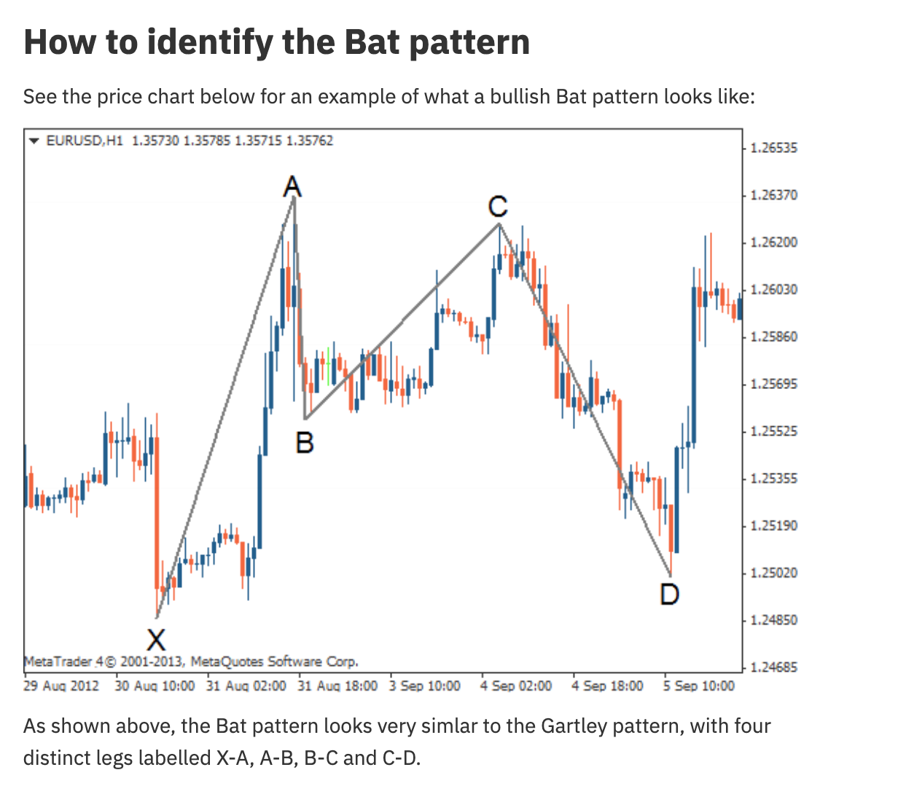
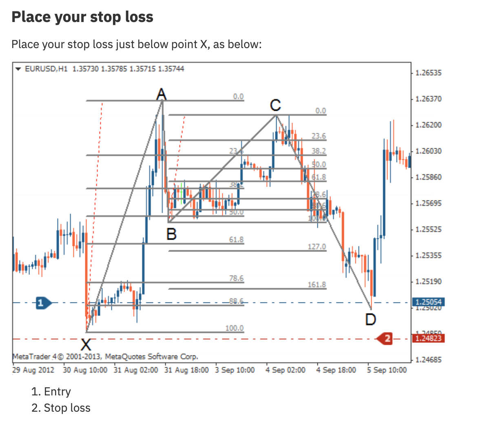

# Bat Pattern




## Definition

The Bat pattern is very similar to the Gartley but with a deeper retracement — point D completes at the **88.6%** retracement of XA (vs 78.6% for Gartley). The AB leg also retraces less (38.2%-50% vs 61.8% for Gartley).

## Fibonacci Ratios

| Leg | Ratio | Description |
|-----|-------|-------------|
| **AB** | 38.2% - 50.0% of XA | Shallower than Gartley |
| **BC** | 38.2% - 88.6% of AB | B-C retraces A-B |
| **CD** | 161.8% - 261.8% of BC | C-D extends B-C |
| **AD** | **88.6% of XA** | Deeper than Gartley (88.6% vs 78.6%) |

## Key Distinguishing Feature

**AD = 88.6% of XA** and **AB = 38.2%-50%**. The shallower AB and deeper AD distinguish the Bat from the Gartley.

## Trading Rules

| Component | Rule |
|-----------|------|
| **Entry** | At point D (88.6% retracement of XA) |
| **Stop Loss** | Just below point X (bullish) or above point X (bearish) |
| **Take Profit 1** | 38.2% retracement of A-D leg |
| **Take Profit 2** | 61.8% retracement of A-D leg |
| **Take Profit 3** | Point A level |

## Agent Detection Logic

```
function detect_bat(swings, tolerance=0.02):
    for x, a, b, c, d in sliding_window(swings, 5):
        xa = abs(a.price - x.price)
        ab = abs(b.price - a.price)
        bc = abs(c.price - b.price)
        cd = abs(d.price - c.price)
        ad = abs(d.price - a.price)
        
        ab_ratio = ab / xa  # Should be 0.382-0.50
        bc_ratio = bc / ab  # Should be 0.382-0.886
        cd_ratio = cd / bc  # Should be 1.618-2.618
        ad_ratio = ad / xa  # Should be ~0.886
        
        if (0.382 - tolerance <= ab_ratio <= 0.50 + tolerance and
            0.382 - tolerance <= bc_ratio <= 0.886 + tolerance and
            1.618 - tolerance <= cd_ratio <= 2.618 + tolerance and
            within(ad_ratio, 0.886, tolerance)):
            
            direction = BULLISH if a.price > x.price else BEARISH
            return BatPattern(x, a, b, c, d, direction)
    
    return None
```
