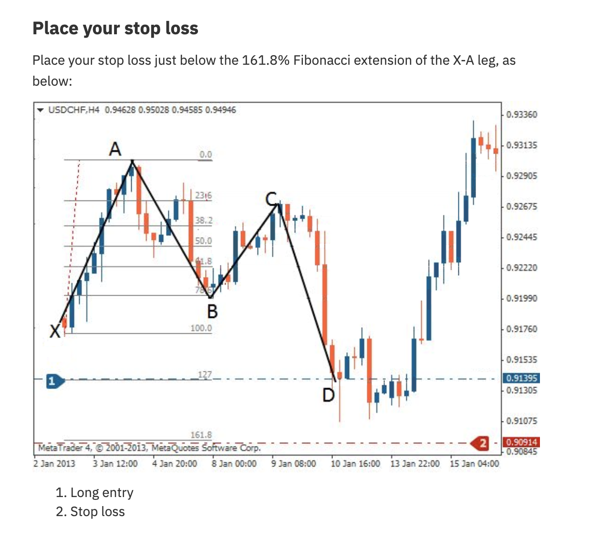
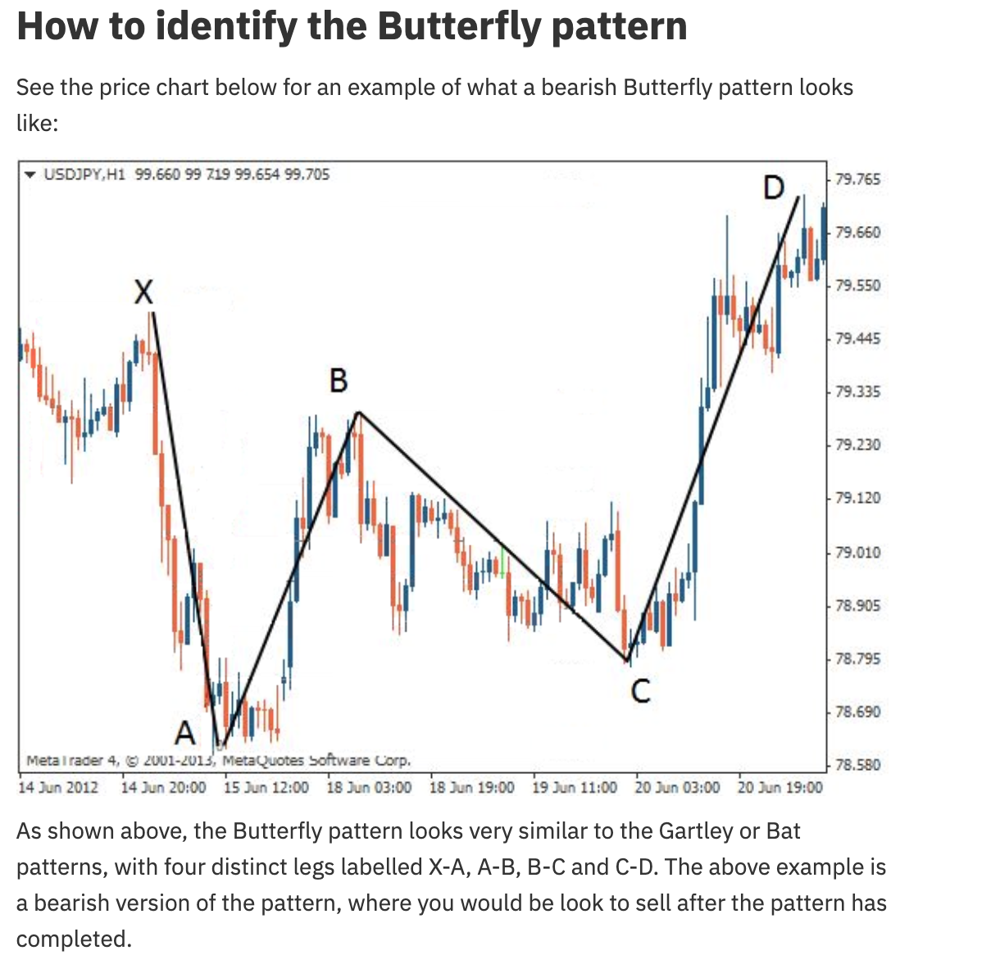

# Butterfly Pattern




## Definition

The Butterfly pattern is similar to the Gartley but the key difference is that point D extends **beyond** point X. This makes it a more extreme pattern that occurs at the end of strong trends. The AD leg is a 127.2%-161.8% extension of XA.

## Fibonacci Ratios

| Leg | Ratio | Description |
|-----|-------|-------------|
| **AB** | 78.6% of XA | A-B retraces 78.6% of X-A |
| **BC** | 38.2% - 88.6% of AB | B-C retraces A-B |
| **CD** | 161.8% - 261.8% of BC | C-D extends significantly beyond B-C |
| **AD** | **127.2% - 161.8% of XA** | D goes **past** X |

## Key Distinguishing Feature

**D goes beyond X.** This is what separates the Butterfly from the Gartley and Bat (where D stays inside X).

## Identification Rules

### Bullish Butterfly
1. X is a significant low
2. Price rallies from X to A
3. Price retraces 78.6% of XA to point B
4. B-C retracement of A-B
5. Price drops from C to D, extending **below** X (127.2%-161.8% of XA)
6. → Buy at point D

### Bearish Butterfly
1. X is a significant high
2. Price drops from X to A
3. Price retraces 78.6% to B
4. Price rallies from C to D, extending **above** X
5. → Sell at point D

## Trading Rules

| Component | Rule |
|-----------|------|
| **Entry** | At point D (127.2%-161.8% extension of XA) |
| **Stop Loss** | Just below/above the 161.8% Fibonacci extension of XA |
| **Take Profit 1** | Point B level |
| **Take Profit 2** | Point A level |

## Agent Detection Logic

```
function detect_butterfly(swings, tolerance=0.02):
    for x, a, b, c, d in sliding_window(swings, 5):
        xa = abs(a.price - x.price)
        ab = abs(b.price - a.price)
        bc = abs(c.price - b.price)
        cd = abs(d.price - c.price)
        
        ab_ratio = ab / xa  # Should be ~0.786
        bc_ratio = bc / ab  # Should be 0.382-0.886
        cd_ratio = cd / bc  # Should be 1.618-2.618
        
        # Key: D extends beyond X
        d_extends_beyond_x = (
            (a.price > x.price and d.price < x.price) or  # Bullish: D below X
            (a.price < x.price and d.price > x.price)     # Bearish: D above X
        )
        
        ad_extension = abs(d.price - a.price) / xa  # Should be 1.272-1.618
        
        if (within(ab_ratio, 0.786, tolerance) and
            0.382 - tolerance <= bc_ratio <= 0.886 + tolerance and
            1.618 - tolerance <= cd_ratio <= 2.618 + tolerance and
            1.272 - tolerance <= ad_extension <= 1.618 + tolerance and
            d_extends_beyond_x):
            
            direction = BULLISH if a.price > x.price else BEARISH
            return ButterflyPattern(x, a, b, c, d, direction)
    
    return None
```
