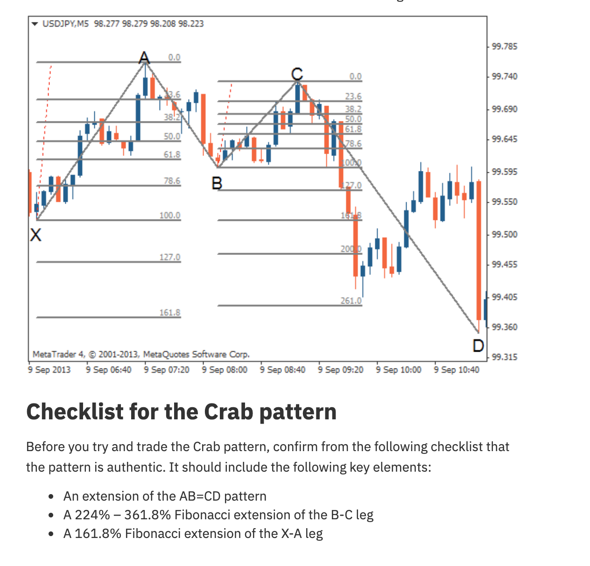
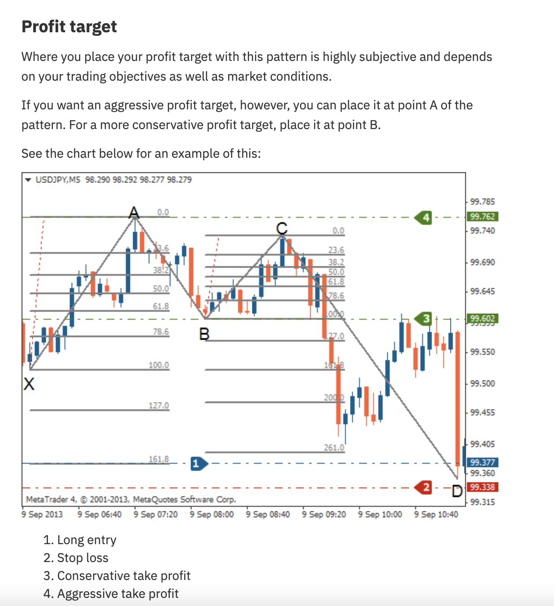

# Crab Pattern




## Definition

The Crab is the most extreme harmonic pattern. Point D extends to the **161.8%** Fibonacci extension of XA — significantly beyond point X. The BC extension is also the most extreme (224%-361.8%). This pattern appears at the end of exhaustive moves.

## Fibonacci Ratios

| Leg | Ratio | Description |
|-----|-------|-------------|
| **AB** | 38.2% - 61.8% of XA | A-B retraces X-A |
| **BC** | 38.2% - 88.6% of AB | B-C retraces A-B |
| **CD** | **224% - 361.8% of BC** | Most extreme extension |
| **AD** | **161.8% of XA** | D goes far past X |

## Key Distinguishing Feature

**AD = 161.8% of XA** and **CD = 224%-361.8% of BC**. The Crab goes further beyond X than any other harmonic pattern.

## Trading Rules

### Bearish Crab
| Component | Rule |
|-----------|------|
| **Short Entry** | At point D (161.8% extension of XA) |
| **Stop Loss** | Just above point D |
| **Conservative TP** | Point B level |
| **Aggressive TP** | Point A level |

### Bullish Crab
| Component | Rule |
|-----------|------|
| **Long Entry** | At point D (161.8% extension below XA) |
| **Stop Loss** | Below point D |
| **Conservative TP** | Point B level |
| **Aggressive TP** | Point A level |

## Full Fibonacci Level Reference (Crab)

| Level | Usage |
|-------|-------|
| 0.0 | — |
| 23.6 | — |
| 38.2 | AB ratio range start |
| 50.0 | AB ratio |
| 61.8 | AB ratio range end |
| 78.6 | — |
| 100.0 | Point X level |
| 127.0 | Near D zone (Butterfly territory) |
| **161.8** | **Crab D completion** |
| 200.0 | Deep extension |
| 261.0 | BC extension zone |
| 361.8 | Maximum BC extension |

## Agent Detection Logic

```
function detect_crab(swings, tolerance=0.03):
    for x, a, b, c, d in sliding_window(swings, 5):
        xa = abs(a.price - x.price)
        ab = abs(b.price - a.price)
        bc = abs(c.price - b.price)
        cd = abs(d.price - c.price)
        
        ab_ratio = ab / xa
        bc_ratio = bc / ab
        cd_ratio = cd / bc
        
        d_extends_far = (
            (a.price > x.price and d.price < x.price - xa * 0.5) or
            (a.price < x.price and d.price > x.price + xa * 0.5)
        )
        
        ad_extension = abs(d.price - a.price) / xa
        
        if (0.382 - tolerance <= ab_ratio <= 0.618 + tolerance and
            0.382 - tolerance <= bc_ratio <= 0.886 + tolerance and
            2.24 - tolerance <= cd_ratio <= 3.618 + tolerance and
            within(ad_extension, 1.618, tolerance) and
            d_extends_far):
            
            direction = BULLISH if a.price > x.price else BEARISH
            return CrabPattern(x, a, b, c, d, direction)
    
    return None
```
