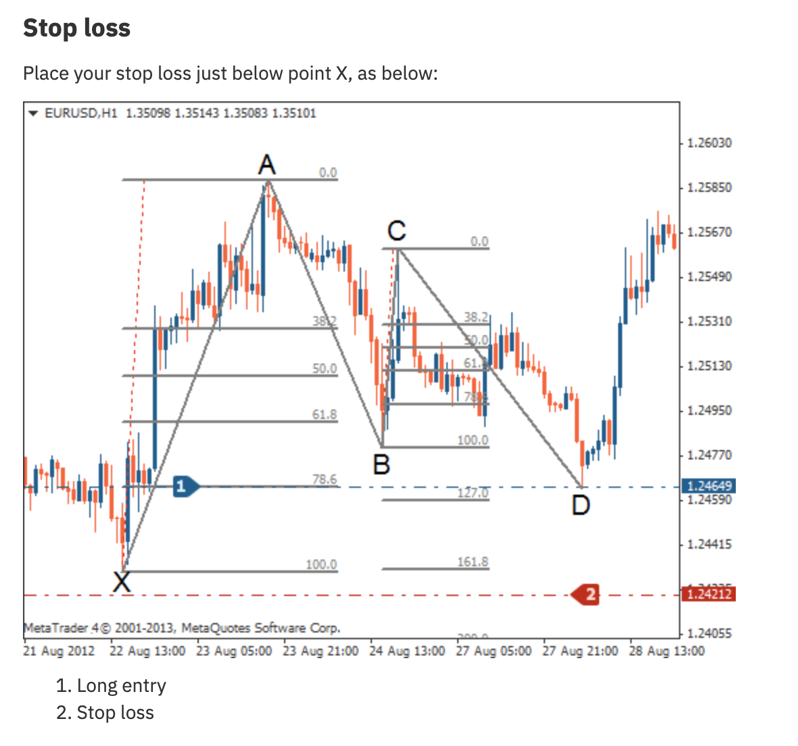
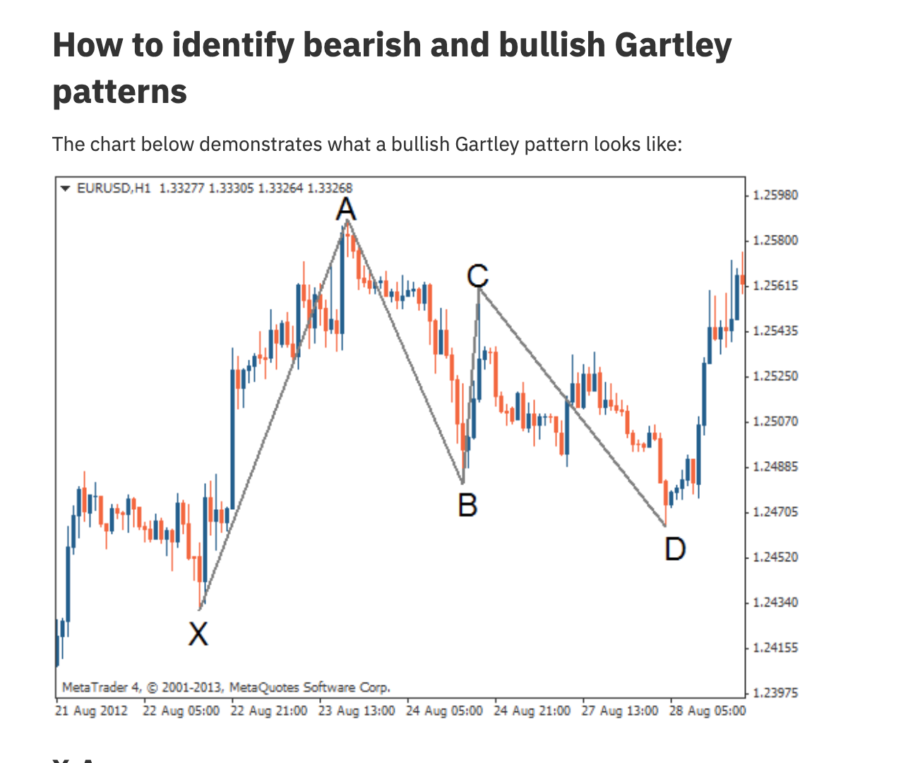

# Gartley Pattern




## Definition

The Gartley is the most common harmonic pattern. It forms an "M" shape (bullish) or "W" shape (bearish) using four price legs (X-A, A-B, B-C, C-D) with specific Fibonacci relationships. Point D completes at the 78.6% retracement of XA, staying inside point X.

## Fibonacci Ratios

| Leg | Ratio | Description |
|-----|-------|-------------|
| **AB** | 61.8% of XA | A-B retraces 61.8% of the X-A leg |
| **BC** | 38.2% - 88.6% of AB | B-C retraces 38.2% to 88.6% of A-B |
| **CD** | 127.2% - 161.8% of BC | C-D extends 127.2% to 161.8% of B-C |
| **AD** | **78.6% of XA** | D completes at 78.6% retracement of X-A |

## Identification Rules

### Bullish Gartley
1. X is a significant low
2. Price rallies from X to A (X-A leg up)
3. Price retraces 61.8% of XA to point B
4. Price rallies from B but doesn't exceed A, reaching C
5. Price drops from C to D, completing at 78.6% of XA
6. D stays **above** X (inside the XA range)
7. → Buy at point D

### Bearish Gartley
1. X is a significant high
2. Price drops from X to A
3. Price retraces 61.8% to B
4. Price drops to C (doesn't exceed A)
5. Price rallies to D at 78.6% of XA
6. D stays **below** X
7. → Sell at point D

## Trading Rules

| Component | Rule |
|-----------|------|
| **Entry** | At point D (78.6% retracement of XA) |
| **Stop Loss** | Just below point X (bullish) or above point X (bearish) |
| **Take Profit 1** | 38.2% retracement of the A-D leg |
| **Take Profit 2** | 61.8% retracement of the A-D leg |
| **Take Profit 3** | Point A level |

## Agent Detection Logic

```
function detect_gartley(swings, tolerance=0.02):
    # Need 5 points: X, A, B, C, D
    for x, a, b, c, d in sliding_window(swings, 5):
        xa = abs(a.price - x.price)
        ab = abs(b.price - a.price)
        bc = abs(c.price - b.price)
        cd = abs(d.price - c.price)
        ad = abs(d.price - a.price)
        
        ab_ratio = ab / xa  # Should be ~0.618
        bc_ratio = bc / ab  # Should be 0.382-0.886
        cd_ratio = cd / bc  # Should be 1.272-1.618
        ad_ratio = ad / xa  # Should be ~0.786
        
        if (within(ab_ratio, 0.618, tolerance) and
            0.382 - tolerance <= bc_ratio <= 0.886 + tolerance and
            1.272 - tolerance <= cd_ratio <= 1.618 + tolerance and
            within(ad_ratio, 0.786, tolerance)):
            
            direction = BULLISH if a.price > x.price else BEARISH
            return GartleyPattern(x, a, b, c, d, direction)
    
    return None
```
