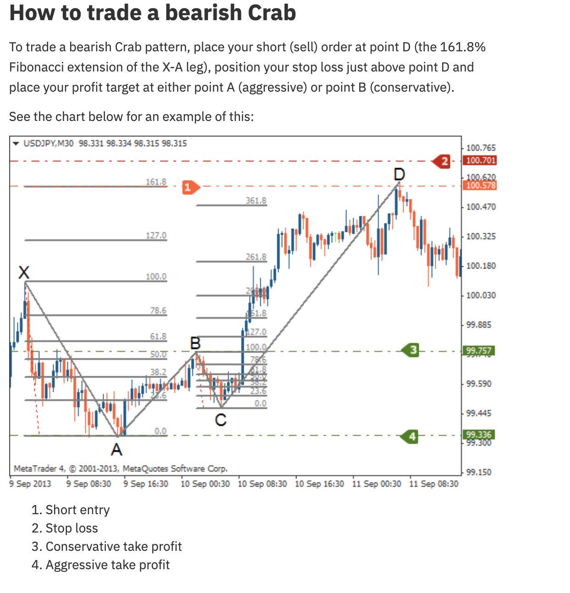
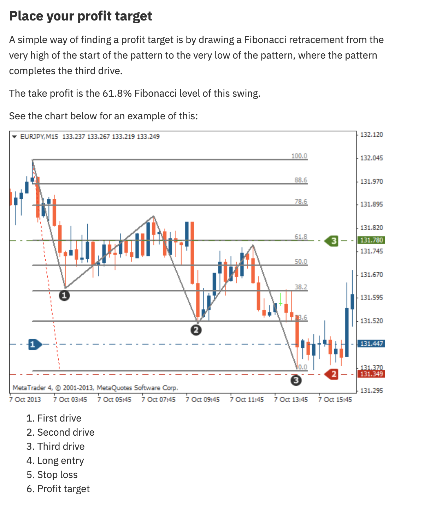

# Three-Drive Pattern




## Definition

The Three-Drive pattern consists of three consecutive pushes (drives) in the same direction, each completing at Fibonacci extension levels. After the third drive, the pattern is exhausted and a reversal is expected.

## Fibonacci Ratios

| Component | Ratio |
|-----------|-------|
| Drive-to-drive retracements | 61.8% - 78.6% |
| Extensions between drives | 127.2% - 161.8% |
| Reversal target after Drive 3 | 61.8% of entire pattern range |

## Structure

### Bearish Three-Drive (3 pushes lower)
1. **Drive 1**: First push down
2. **Correction 1**: Retraces 61.8%-78.6% of Drive 1
3. **Drive 2**: Second push down (127.2%-161.8% extension of Correction 1)
4. **Correction 2**: Retraces 61.8%-78.6% of Drive 2
5. **Drive 3**: Third and final push down (127.2%-161.8% extension of Correction 2)
6. → **Reversal**: Buy at completion of Drive 3

### Bullish Three-Drive (3 pushes higher)
- Inverse of above
- → Sell at completion of Drive 3

## Trading Rules

| Component | Rule |
|-----------|------|
| **Entry** | After Drive 3 completes (at the extension level) |
| **Stop Loss** | Below the third drive's low (bullish) or above its high (bearish) |
| **Take Profit** | 61.8% Fibonacci retracement from the pattern's start to the Drive 3 extreme |

## Agent Detection Logic

```
function detect_three_drive(swings, tolerance=0.03):
    # Need at least 7 points: start, drive1_end, corr1_end, drive2_end, corr2_end, drive3_end
    if len(swings) < 7:
        return None
    
    for i in range(len(swings) - 6):
        points = swings[i:i+7]
        
        drive1 = abs(points[1].price - points[0].price)
        corr1 = abs(points[2].price - points[1].price)
        drive2 = abs(points[3].price - points[2].price)
        corr2 = abs(points[4].price - points[3].price)
        drive3 = abs(points[5].price - points[4].price)
        
        # Check retracement ratios
        corr1_ratio = corr1 / drive1  # Should be 0.618-0.786
        corr2_ratio = corr2 / drive2  # Should be 0.618-0.786
        
        # Check extension ratios
        drive2_ext = drive2 / corr1  # Should be 1.272-1.618
        drive3_ext = drive3 / corr2  # Should be 1.272-1.618
        
        if (0.618 - tolerance <= corr1_ratio <= 0.786 + tolerance and
            0.618 - tolerance <= corr2_ratio <= 0.786 + tolerance and
            1.272 - tolerance <= drive2_ext <= 1.618 + tolerance and
            1.272 - tolerance <= drive3_ext <= 1.618 + tolerance):
            
            # All three drives in same direction
            same_dir = (points[1].price < points[0].price and 
                       points[3].price < points[2].price and
                       points[5].price < points[4].price)
            
            if same_dir:
                return ThreeDrivePattern(points, direction=BULLISH)  # Reversal up
            
            same_dir_up = (points[1].price > points[0].price and 
                          points[3].price > points[2].price and
                          points[5].price > points[4].price)
            if same_dir_up:
                return ThreeDrivePattern(points, direction=BEARISH)  # Reversal down
    
    return None
```
